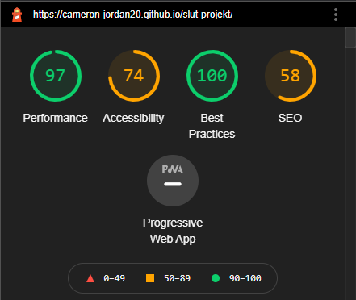
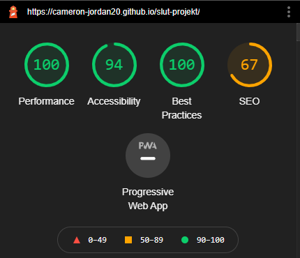

# Slut Projekt

 This is the final project for WEBWEB01 at the International IT College of Sweden, Stockholm
 Built using HTMl, CSS and Javascript (references to jQuery by way of github-stats by liuyang)

 ---

## Open My Website On Your Phone to Check the Responsive Design

 
_However, please note that dark mode is only implemented for desktop_

## Credit:
 _Mobile Menu Code_ -- Saijo George - https://codemyui.com/fixed-bottom-edge-mobile-menu-animation/
  
 _Github Activity Display_ -- liuyang - https://github.com/magicoder10/github-stats

---

## Structures and Techniques
### File Structure
_CSS (folder)_
 &nbsp;&nbsp;&nbsp;&nbsp;&nbsp;&nbsp; _CSS files_
 _images (folder)_
 &nbsp;&nbsp;&nbsp;&nbsp;&nbsp;&nbsp; _images files_
 _javascript (folder)_
 &nbsp;&nbsp;&nbsp;&nbsp;&nbsp;&nbsp; _javascript files_
 _html files_
 _README.md_

---

## Sitemap:

## Wireframe:

---

## Accessibility:

### Before:

### After:

### Alternate Web Browsers
Tested and functional on: Chrome, Edge, Firefox, Chrome Mobile and Safari Mobile
 
* it should be noted however that the calling of psuedo classes such as :hover and :active appear to not function in the same way
on mobile browsers, causing some minor issues within the Web Laws site, as well as causing some small alterations
to the mobile navbar upon open and closing actions.

 -- Cameron Jordan
