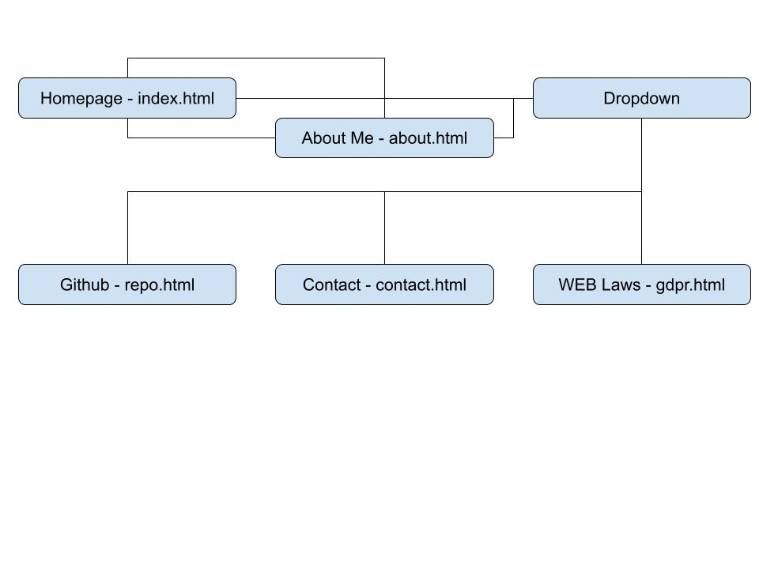
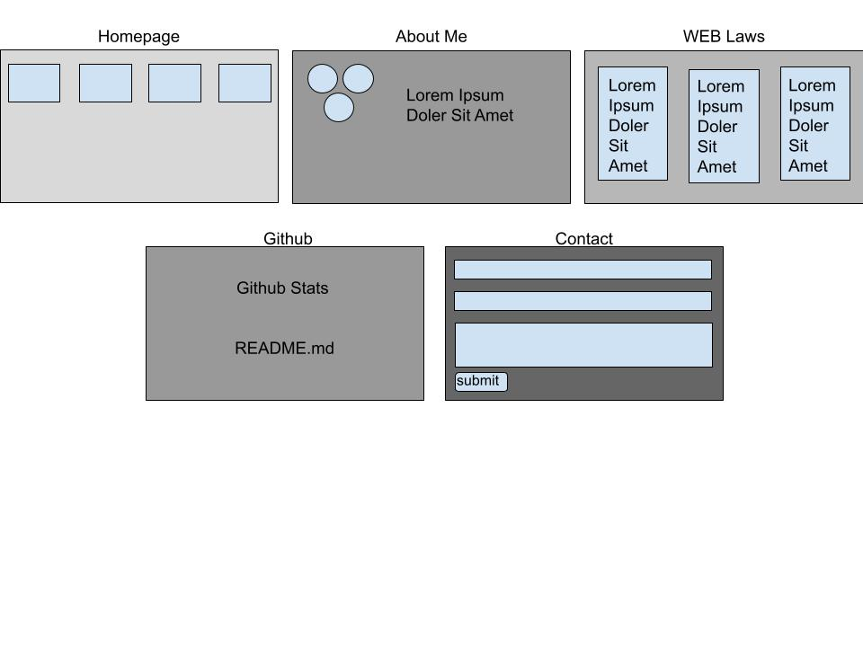

# Slut Projekt

 This is the final project for WEBWEB01 at the International IT College of Sweden, Stockholm
 Built using HTMl, CSS and Javascript (references to jQuery by way of github-stats by liuyang)

 ---

## Open My Website On Your Phone to Check the Responsive Design

 
_However, please note that dark mode is only implemented for desktop_

## Credit:
 _Mobile Menu Code_ -- Saijo George - https://codemyui.com/fixed-bottom-edge-mobile-menu-animation/
  
 _Github Activity Display_ -- liuyang - https://github.com/magicoder10/github-stats

---

## Structures and Techniques
### File Structure
_CSS (folder)_
&nbsp;&nbsp;&nbsp;&nbsp;&nbsp;&nbsp; _CSS files_
_images (folder)_
&nbsp;&nbsp;&nbsp;&nbsp;&nbsp;&nbsp; _images files_
_javascript (folder)_
&nbsp;&nbsp;&nbsp;&nbsp;&nbsp;&nbsp; _javascript files_
_html files_
_README.md_

---

## Sitemap:

## Wireframe:

---

## Accessibility:

### Before:

### After:

### Alternate Web Browsers
Tested and functional on: Chrome, Chrome Mobile, Edge, Safari,

 -- Cameron Jordan
